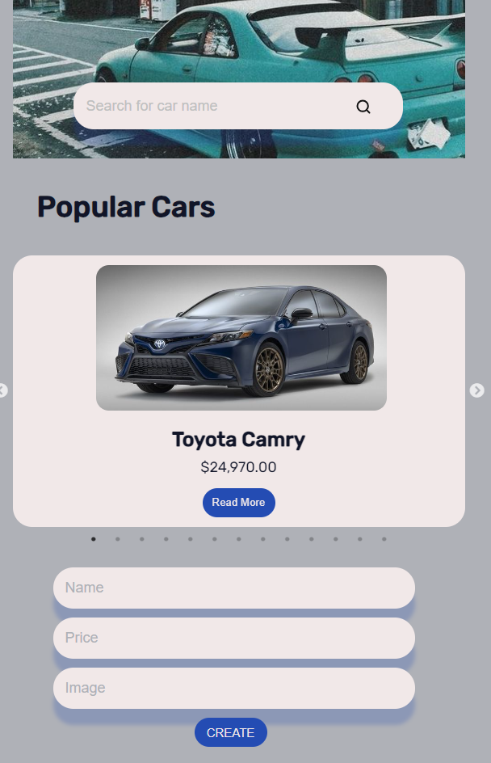

# Cars App (React)

This repository contains a React-based web application for managing car listings.

## About the Project

The Cars App is a React-based web application designed to manage car listings. It provides users with features to browse, add, edit, and delete car listings, making it convenient for both car sellers and buyers.

## Features

- **Car Listings:** View a list of available cars with details such as make, model, year, and price.
- **Add/Edit/Delete Listings:** Users can add new car listings, edit existing ones, and delete listings as needed.
- **Search and Filter:** Search for specific cars and filter listings based on criteria such as make, model, year, and price range.
- **Responsive Design:** The app is designed to be responsive, ensuring a seamless experience across different devices.

## Technologies Used

- React
- HTML/CSS
- JavaScript

## Getting Started

To get a local copy up and running follow these simple steps.

### Prerequisites

- Node.js
- npm

### Installation

1. Clone the repo
   ```sh
   git clone https://github.com/Saaayurii/Cars-app-React.git


### Screenshots



